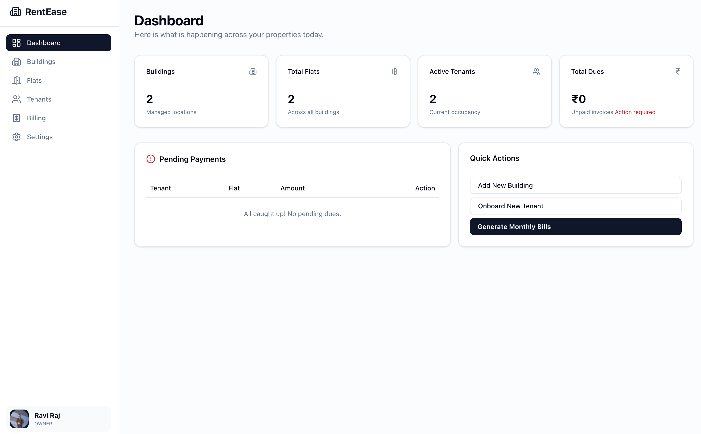
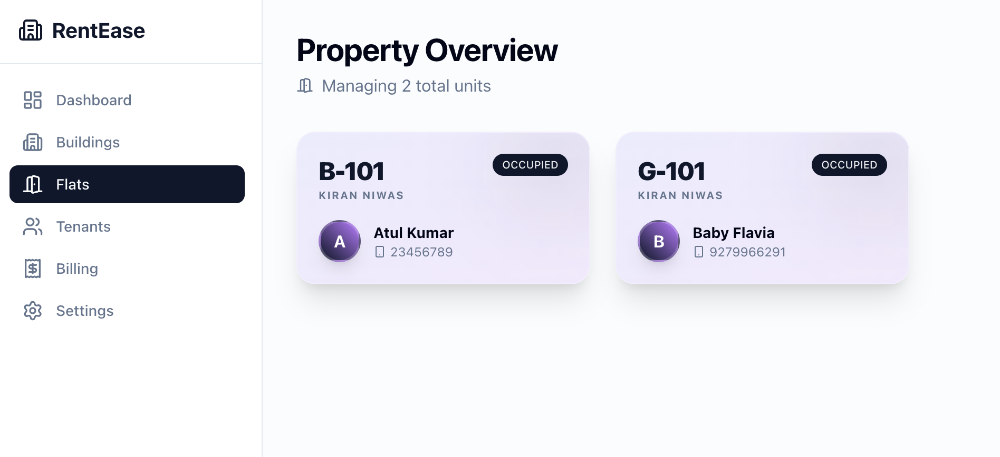
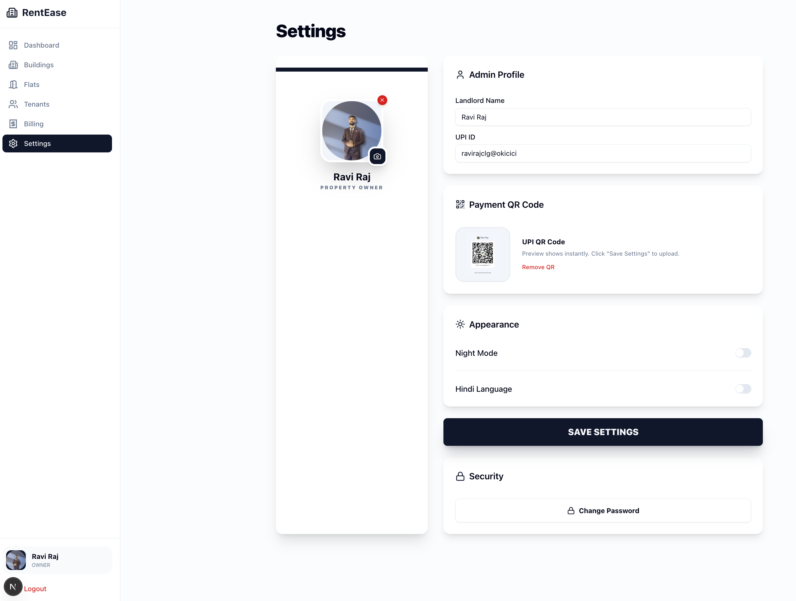

# 🏢 RentEase — Modern Rental Management for Small Landlords

**RentEase** is a high-performance, mobile-first web application designed specifically for small-to-medium landlords and family-run rental businesses. It eliminates manual notebooks and complex Excel sheets, replacing them with a beautiful, automated, and bilingual (English/Hindi) management experience.


---

## 🌟 The Evolution

### Phase 1: The MVP (The Foundation)
The journey started with a simple goal: automate rent and electricity calculations.
- Basic Building & Flat management.
- Tenant records.
- Automated monthly bill generation.
- Email/Password authentication.

### Phase 2: The "Power Version" (Current)
Based on real-world feedback for senior landlords (like the founder's mother), we added professional-grade features:
- **Glassmorphism UI:** A stunning, minimalist card-based interface with "blurry" transparent effects.
- **Bilingual Support:** One-tap toggle to switch the entire app between **English and Hindi**.
- **Instant UPI Integration:** Generated PDFs include a "Pay Now" button that triggers UPI apps (PhonePe/GPay) on mobile with the exact amount pre-filled.
- **Visual Identity:** Profile picture uploads for both Landlords and Tenants.
- **KYC Vault:** Secure storage for Aadhaar cards, agreements, and identity documents.
- **Bilingual WhatsApp Reminders:** Automated English/Hindi payment reminders sent with a single click.
- **Advanced Billing:** Support for "Paid", "Due", and "Advance Paid" statuses with bulk delete options.

---

## 🚀 Key Features

### 🏠 Property Management
- **Hierarchical Structure:** Manage multiple Buildings -> Flats -> Tenants.
- **Glassy Overviews:** Visual indicators for "Occupied" (Gradient) vs "Vacant" (Outlined) units.
- **Smart Check-Out:** Automated room vacancy and final settlement logic.

### 💰 Billing & Payments
- **Auto-Calculator:** Input meter readings and let the app handle the electricity (unit-based) and room rent totals.
- **Professional Invoices:** Generate high-detail PDFs with Landlord branding and QR Codes.
- **UPI Deep-Linking:** Tenants can click a link in the PDF to pay instantly via their preferred UPI app.
- **One-Tap Reminders:** Send bilingual payment reminders via WhatsApp.

### 🔒 Security & Performance
- **Supabase RLS:** Row-Level Security ensures Landlords can *only* see their own data.
- **Storage:** Secure private buckets for sensitive identity documents.
- **Dark Mode:** A sleek "Night Mode" for low-light usage.

---

## 🛠 Tech Stack

- **Framework:** [Next.js 15 (App Router)](https://nextjs.org/)
- **Database & Auth:** [Supabase](https://supabase.com/)
- **Styling:** [Tailwind CSS](https://tailwindcss.com/)
- **UI Components:** [shadcn/ui](https://ui.shadcn.com/)
- **PDF Generation:** [@react-pdf/renderer](https://react-pdf.org/)
- **Toasts:** [Sonner](https://sonner.stevenly.me/)
- **Icons:** [Lucide React](https://lucide.dev/)

---

## 📥 Installation & Local Setup

If you want to fork this project and run it locally, follow these steps:

### 1. Clone the repository
```bash
git clone https://github.com/your-username/rentease.git
cd rentease
```

### 2. Install dependencies
```bash
pnpm install
```

### 3. Setup Environment Variables
Create a `.env.local` file in the root directory:
```env
NEXT_PUBLIC_SUPABASE_URL=your_supabase_project_url
NEXT_PUBLIC_SUPABASE_ANON_KEY=your_supabase_anon_key
```

### 4. Database Setup (Supabase)
1. Run the SQL scripts provided in the `/supabase/migrations` folder (or the scripts found in the dev documentation) in your Supabase SQL Editor.
2. Create a Storage Bucket named `tenant-documents` and set its privacy to **Public**.

### 5. Run the development server
```bash
pnpm dev
```
Open [http://localhost:3000](http://localhost:3000) with your browser to see the result.

---

## 📸 Screenshots

| Dashboard | Glassy Flat Cards | Tenant Profile | Admin Settings |
|-----------|-------------------|----------------|----------------|
|  |  |  |  |

## 🤝 Contributing
Forks and Pull Requests are welcome! For major changes, please open an issue first to discuss what you would like to change.

## 📄 License
This project is licensed under the MIT License.
